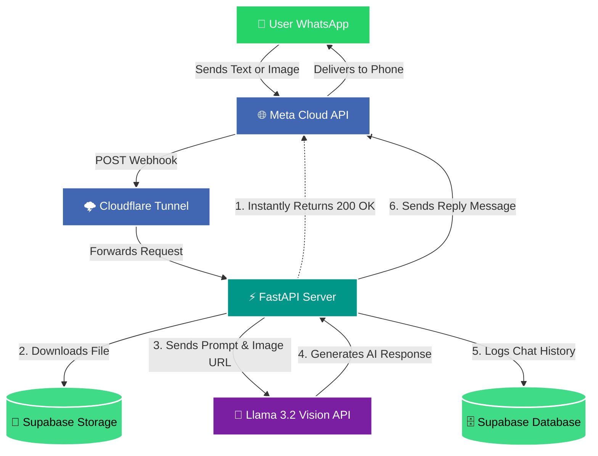

# 🎓 Voraus AI - Educaro WhatsApp Bot

Voraus AI is an intelligent WhatsApp bot designed to assist students with German university admissions, vocational training, visas, and bureaucracy. 

Powered by **Llama 3.2 11B Vision**, this bot can answer complex questions, read and extract information from documents/images (OCR), and seamlessly store all interactions and datasets in **Supabase**.

---

## 🏗️ Architecture & Flowchart

The bot is built using FastAPI and runs in real-time, utilizing Background Tasks to instantly acknowledge WhatsApp messages preventing Meta from timing out the connection.



---

## ✨ Key Features
* **Multi-Modal AI Vision:** Reads and processes both text messages and uploaded images/documents (transcripts, marksheets, certificates) using NVIDIA Llama 3.2 11B Vision.
* **Native Typing Indicators (`...`):** Automatically displays Meta's animated 3-dot typing bubble and read receipts to provide responsive visual feedback while AI generates answers.
* **Instant Acknowledgment:** Uses FastAPI `BackgroundTasks` to return `200 OK` in milliseconds, preventing Meta's webhook timeout drops.
* **Automated Cloud Backup:** Downloads media files and archives them in Supabase Storage (`chat_media`), with persistent database records in `chat_history`.
* **Knowledge Base Engine:** Preloaded with 22 structured datasets in Supabase covering German universities, visa stages, APS requirements, living expenses, and timelines.

---

## 🚀 Novelty Features & Strategic Value Proposition

While a dedicated web/mobile app serves as a detailed workspace, this WhatsApp Bot acts as the high-converting **acquisition engine and 24/7 pocket advisor**. Here is what makes the WhatsApp bot uniquely powerful:

### 1. "Camera-First" Document Ingestion (Zero-Friction OCR)
* **The Problem:** Scanning transcripts, grade sheets, or APS documents into desktop portals feels slow and tedious.
* **The Novelty:** Students snap a photo on their phone and hit send on WhatsApp. Llama 3.2 Vision performs immediate OCR, extracts grades/credits, calculates their German Grade (Bavarian Formula), and matches them with eligible public universities in seconds.

### 2. Zero-Download, Frictionless Lead Acquisition
* **The Problem:** Up to 80% of potential students drop off when forced to download an app and fill out sign-up forms.
* **The Novelty:** 1-tap entry from Instagram, YouTube, or Google Ads directly into WhatsApp. No account creation or passwords required—the user's phone number becomes their verified ID.

### 3. The Omnichannel "Shared Brain"
* **The Novelty:** The WhatsApp bot and the central Web App share the exact same Supabase database.
* **Workflow:** A student sends their marksheet on WhatsApp → the file is backed up into `chat_media` and their profile is created in `users`. When they later log into the Web App, their dashboard is pre-filled without re-entering data.

### 4. Proactive Bureaucracy Nudges (Anti-Ghosting Engine)
* **The Problem:** Web apps are passive—users often forget to log back in, missing critical admission or visa deadlines.
* **The Novelty:** WhatsApp commands a **~98% open rate**. The bot can push timely, personalized reminders:
  * *"The Winter semester Uni-Assist deadline for TU Munich is in 5 days. Have you received your APS certificate?"*
  * *"A new English-taught Master's program in Data Science just opened matching your profile."*

### 5. Instant German Bureaucracy Decoder
* **The Problem:** Official German letters (*Zulassungsbescheid*, *Meldebescheinigung*, *Sperrkonto* updates) are intimidating and difficult for international students to interpret.
* **The Novelty:** Students simply forward a snapshot of the German letter, and the bot translates and explains the exact action items in clear English.

### 6. Parent & Tier-2/3 Regional Accessibility
* **The Problem:** Parents fund the education and need reassurance on finances and blocked accounts, but rarely install new SaaS apps.
* **The Novelty:** Parents and students in tier-2/3 cities can consult the bot directly on WhatsApp with zero technical friction and low bandwidth consumption.

---

## 🇮🇳 Special India-Tailored Features

1. **Real-Time INR Budget & Part-Time Calculator:**
   - Automatically converts Blocked Account requirements (€11,904 ≈ ₹10.95 Lakhs) and Semester contributions (€200–€350 ≈ ₹18k–₹32k) into real-time INR at 1 EUR ≈ ₹92.
   - Calculates student Werkstudent wages (140 full days / 280 half days per year, earning €850–€1,300/mo ≈ ₹78,000–₹1,20,000 INR/mo) to prove how living costs are self-funded.

2. **Instant APS India & Anabin Verifier:**
   - Guidance on mandatory APS India certificate requirements (₹18,000 fee, DigiLocker verification, professor email checks, 3–8 week processing).
   - Anabin database status checks (H+, H+/-, H-), 3-year (180 ECTS) vs 4-year (240 ECTS) bachelor degree equivalence, and German GPA conversions (Bavarian Formula).

3. **City "Desi Comfort Index" (out of 10):**
   - Ranks and scores German student cities on Indian grocery availability, Indian student associations (ISAG), vegetarian/halal accessibility, and rental affordability (€350 in Chemnitz/Magdeburg vs €850+ in Munich).

4. **WhatsApp Voice Note Queries (Native Audio Transcription):**
   - Students on the go can send voice notes in Indian English or Hindi.
   - Audio is converted in-memory using `soundfile` and transcribed with `SpeechRecognition`, queried through Llama 3.2, and delivered back with a `🎙️ I heard: "..."` preview.

5. **Forward-to-Parents Summary Cards:**
   - Auto-generates structured, reassurance-packed summary cards formatted for students to forward directly to Indian parents on WhatsApp.
   - Highlights €0 tuition fees, 100% blocked account safety (money returned monthly to student), legal work rights, and safety.

6. **Indian Education Loan & Sponsor Advisor:**
   - Evaluates Public Banks (SBI Global Ed-Vantage, BoB at ~9.5%–10.5%) vs NBFCs (HDFC Credila, Avanse, InCred up to ₹50 Lakhs unsecured).
   - Details the critical German Embassy / VFS visa requirement (sanction letter must state disbursement into Blocked Account/Sperrkonto) and Section 80E tax deduction benefits.

---

## 🛠️ Setup Instructions

### 1. Install Dependencies
Make sure you have Python installed, then run:
```bash
pip install -r requirements.txt
```
*(Dependencies include: `fastapi`, `uvicorn`, `requests`, `supabase`, `openai`, `pandas`, `sqlalchemy`, `psycopg2-binary`)*

### 2. Environment Variables
Create a `.env` file in the root directory and add the following keys:
```env
WHATSAPP_TOKEN=your_meta_temporary_or_permanent_token
VERIFY_TOKEN=voraus_ai_verify_token_123
SUPABASE_URL=https://your-project.supabase.co
SUPABASE_KEY=your_anon_public_key
LLAMA_API_KEY=nvapi-your-nvidia-api-key
```

### 3. Supabase Configuration
You need two things set up in your Supabase project:
1. **Database Table:** A table named `chat_history` with columns `user_phone`, `user_message`, and `ai_response`.
2. **Storage Bucket:** A bucket named exactly `chat_media`. **It must be set to PUBLIC** so the AI can read the images.

---

## 🚀 How to Run the Bot

You will need **two terminal windows** open at the same time.

**Terminal 1: Start the Python Server**
```bash
python -m uvicorn main:app --reload
```

**Terminal 2: Start the Cloudflare Tunnel**
```bash
.\cloudflared.exe tunnel --url http://localhost:8000
```
*Copy the `https://...trycloudflare.com` URL that Cloudflare generates. Go to your Meta Developer Dashboard, edit your WhatsApp Webhook, paste the URL (add `/whatsapp` to the end of it), and verify using the token `voraus_ai_verify_token_123`.*

---

## 📁 How to Upload Datasets
If you have new CSV datasets (like Course Guides, Visas, etc.), put them in the `educaro datasets` folder. 

1. Open `upload_datasets.py`.
2. Update line 10 with your direct Supabase Database Password.
3. Run the script:
```bash
python upload_datasets.py
```
This script bypasses the buggy Supabase Dashboard CSV uploader and builds perfectly typed database tables automatically!