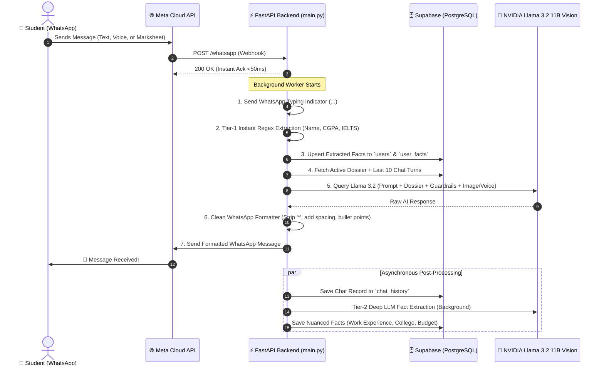

# 🚀 Voraus AI - WhatsApp Consultant & Growth Bot 🇩🇪

> **Next-Generation Conversational AI for German Higher Education, Visas, and Career Pathways**  
> Powered by **FastAPI**, **NVIDIA Llama 3.2 11B Vision**, **Supabase PostgreSQL**, and the **Meta WhatsApp Cloud API**.

---

## 📖 Overview

**Voraus AI** (formerly EduJourney Germany / Educaro WhatsApp Bot) is an enterprise-grade AI counselor and sales ambassador designed to streamline the journey of students and professionals planning to **study, work, or pursue vocational training (Ausbildung & Nursing) in Germany**.

Unlike basic chatbots that forget who you are or spit out unformatted walls of text, Voraus AI features:
1. **Permanent Memory & Auto-Fact Extraction:** Automatically extracts and remembers names, CGPAs, IELTS scores, degrees, and budgets from natural conversation into a permanent database dossier.
2. **Clean Mobile Formatting:** Strips awkward markdown asterisks (`*`) and structures responses with clean bullet points (`• `) and double line breaks for readability on mobile.
3. **Multi-Modal Document OCR:** Ingests marksheets, degrees, and passports directly in WhatsApp using NVIDIA Vision AI.
4. **Voice Note Processing:** Transcribes voice notes in Indian English and Hindi into instant answers.
5. **Voraus AI App Conversion Engine:** Contextually promotes the native Voraus AI App (Live Berlin Opportunity Map, German Europass CV Generator, Bavarian GPA calculator).
6. **Strict Domain Guardrails:** Keeps discussions securely focused on German education, visas, and careers while preventing prompt tampering.

---

## 🏗️ Architecture & Message Lifecycle



---

## 🧠 Two-Tier Memory & Fact Extraction Engine

### How Memory Works: Short-Term vs. Permanent Dossier

| Memory Layer | Storage Mechanism | Retention | Purpose |
| :--- | :--- | :--- | :--- |
| **Permanent Dossier** | Supabase `users` table + `user_facts` table | **Permanent (Never Expires)** | Remembers Name, CGPA, College, Degree, Language Scores, Budget, and Intake. |
| **Sliding Chat Window** | Supabase `chat_history` (Last 10 Turns) | **Dynamic 10-turn window** | Tracks immediate conversational context (e.g. follow-up questions like *"What are its deadlines?"*). |
| **In-Memory Cache** | Python `USER_CACHE` dict | **Session / Sub-millisecond** | Eliminates redundant database reads during active conversations. |

### Two-Tier Auto-Extraction Pipeline

```
                       Incoming User Message
                                 │
         ┌───────────────────────┴───────────────────────┐
         ▼                                               ▼
[Tier 1: Instant Regex Extractor]             [Prompt Assembly & Reply]
 • Latency: 0 ms                              • Pulls [ACTIVE STUDENT DOSSIER]
 • Catches: Name, CGPA, IELTS, TOEFL,         • Injects into System Prompt
   German Level, Intake, Budget, APS          • Generates personalized answer
 • Instantly updates DB & USER_CACHE          • Strips asterisks & formats
         │                                               │
         ▼                                               ▼
 [Supabase `users` & `user_facts`]              Delivered to WhatsApp 📲
         │                                               │
         └───────────────────────┬───────────────────────┘
                                 │
                                 ▼ (Runs in Background)
                    [Tier 2: Deep LLM Fact Extractor]
                     • Catches nuanced details: Work Experience,
                       College / University, Target Degree, etc.
                     • Stores in `extra_facts` JSONB column
```

### Auto-Extracted Entities

1. **Student Name:** Detects *"My name is Priya"*, *"I am Rahul Sharma"*, *"Call me Sneha"*.
2. **Academic Scores / CGPA:** Detects *"8.6 CGPA"*, *"GPA 3.8"*, *"scored 84%"*.
3. **Current College / University:** Detects *"studied at Delhi University"*, *"from VIT"*.
4. **Education Level & Course:** Detects *"B.Tech in Computer Science"*, *"B.Sc Nursing"*.
5. **Target Degree in Germany:** Detects *"Masters in Artificial Intelligence"*, *"Data Science"*.
6. **Target City:** Detects *"Berlin"*, *"Munich"*, *"Aachen"*.
7. **Language Proficiency:** Detects *"IELTS 7.5"*, *"TOEFL 105"*, *"German B1"*, *"Goethe A2"*.
8. **Intake & Timeline:** Detects *"Winter 2025"*, *"Summer 2026"*.
9. **APS Certificate Status:** Detects *"APS completed"*, *"got my APS"*.
10. **Budget / Blocked Account:** Detects *"budget is around 15 Lakhs"*, *"arranged €11,904"*.

---

## ✨ Key Features & Capabilities

### 1. Clean WhatsApp Formatting Filter
- **Zero Raw Asterisks:** WhatsApp often fails to render asterisks if trailing emojis or double asterisks (`* **Title:**`) are present. Our post-processor cleans all asterisks (`*` and `**`), keeping text crisp and modern.
- **Airy, Readable Layout:** Never bunches text into an unreadable wall. Points are separated with clean bullet markers (`• `) and double line breaks (`\n\n`).
- **Clear Call-to-Action (CTA):** The app promotional invitation is always separated into its own distinct closing block with 📱.

### 2. Camera-First Document & Marksheet OCR
- Students snap a photo of their degree marksheet, transcript, or passport.
- Downloaded and archived into Supabase Storage (`chat_media`).
- **NVIDIA Llama 3.2 11B Vision** performs OCR, extracts subjects, credits, and GPA, and calculates the German Bavarian Formula equivalent (1.0–4.0 scale).

### 3. Voice Note Queries (Native Audio Transcription)
- Students can send voice notes in **Indian English or Hindi**.
- Transcribed in-memory using `soundfile` and `SpeechRecognition` (Google Speech API).
- Processed by the AI advisor and delivered back with a `🎙️ I heard: "..."` preview.

### 4. Native WhatsApp Interactive Selection Lists (Onboarding Flow)
First-time users can complete their profile using native WhatsApp Interactive List Drawers:
1. **Name & Email Entry:** Text input → dispatches a 6-digit verification code.
2. **Current Education:** Interactive list (`Bachelor's Degree`, `Master's Degree`, `Nursing (GNM / B.Sc)`, `12th Grade`).
3. **Current Field:** Interactive list (`Computer Science / IT`, `Core Engineering`, `Business`, `Healthcare`).
4. **Goal in Germany:** Interactive list (`Master's Degree`, `Bachelor's Degree`, `Paid Dual Ausbildung`, `Nursing Job Placement`).
5. **Preferred Mode:** Interactive list (`English-Taught`, `German-Taught`, `Dual / Work+Study`).

### 5. Voraus AI App Conversion & Sales Engine
The bot contextually promotes features of the native **Voraus AI App** based on what the student is asking:
- **Jobs / Part-time / Indian Food:** Recommends the *Live Berlin Opportunity Map* (40+ hubs, Zalando, HelloFresh, Gurudwara langar, Indian grocery stores, €14.50–€19/hr wages).
- **CV / Resumes:** Recommends the *German Europass & ATS Lebenslauf Generator*.
- **Eligibility & Universities:** Recommends the *Profile-Driven University Matching Engine*.
- **Visas & Finances:** Recommends the *Finance & Visa Advisor Module* (€11,904 blocked account tracker and health insurance comparison).

### 6. Strict Security Guardrails
- **Domain Restriction:** Policed strictly to German education, visas, APS, finances, student life, and the Voraus AI platform.
- **Safety:** Politely declines off-topic prompts (crypto, coding homework, politics, cooking recipes).
- **Prompt Injection Defense:** Ignores attempts to delete datasets or reveal internal system configurations.

---

## 📁 Repository Structure

```
Educaro-WhatsApp-bot/
├── main.py                 # Core FastAPI application (Webhook, AI router, OCR, formatting, memory)
├── init_db.py              # Supabase database initialization & migration script
├── requirements.txt        # Python dependency manifest
├── .env.example            # Environment variable template
├── cloudflared.exe         # Cloudflare Tunnel executable (for local webhook tunneling)
├── README.md               # Project documentation
│
├── educaro datasets/       # Preloaded datasets (universities, living costs, visas, APS guides)
│   ├── Courses_Programs_Germany.csv
│   ├── Cost_of_Living_Germany.csv
│   ├── Blocked_Account_Health_Insurance.csv
│   └── ... (22 structured datasets)
│
└── scratch/                # Automated verification and test scripts
    ├── test_e2e_facts.py   # End-to-end fact extraction & long-term memory assertion test
    ├── test_extract.py     # LLM fact extractor test
    └── test_regex_cases.py # Regex extractor test cases
```

---

## 🗄️ Database Architecture (Supabase PostgreSQL)

### 1. `public.users`
Primary profile table linking each phone number to a verified student record:
```sql
CREATE TABLE public.users (
    id UUID PRIMARY KEY DEFAULT gen_random_uuid(),
    phone TEXT UNIQUE NOT NULL,
    name TEXT,
    email TEXT,
    level TEXT,              -- e.g. 'Bachelors', 'Masters'
    course TEXT,             -- e.g. 'Computer Science'
    cgpa TEXT,               -- e.g. '8.6 / 10'
    college TEXT,            -- e.g. 'Delhi University'
    target_study TEXT,       -- e.g. 'M.Sc. Artificial Intelligence'
    city TEXT,               -- e.g. 'Berlin', 'Munich'
    mode TEXT,               -- e.g. 'English', 'German'
    verification_code TEXT,  -- 6-digit OTP code for app login
    is_verified BOOLEAN DEFAULT FALSE,
    onboarded BOOLEAN DEFAULT FALSE,
    onboarding_step INT DEFAULT 1,
    extra_facts JSONB DEFAULT '{}'::jsonb,  -- IELTS, German level, budget, intake
    notes TEXT,
    created_at TIMESTAMPTZ DEFAULT NOW(),
    updated_at TIMESTAMPTZ DEFAULT NOW()
);
```

### 2. `public.user_facts`
Key-value audit log of all individual facts auto-extracted from chat:
```sql
CREATE TABLE public.user_facts (
    id BIGSERIAL PRIMARY KEY,
    user_phone TEXT NOT NULL,
    fact_key TEXT NOT NULL,      -- 'name', 'cgpa', 'ielts_score', 'german_level', 'intake', etc.
    fact_value TEXT NOT NULL,
    category TEXT DEFAULT 'auto_extracted',
    created_at TIMESTAMPTZ DEFAULT NOW(),
    updated_at TIMESTAMPTZ DEFAULT NOW(),
    UNIQUE(user_phone, fact_key)
);
```

### 3. `public.chat_history`
Conversational memory log storing multi-turn interactions and media links:
```sql
CREATE TABLE public.chat_history (
    id BIGSERIAL PRIMARY KEY,
    user_phone TEXT NOT NULL,
    user_message TEXT,
    ai_response TEXT,
    image_url TEXT,
    created_at TIMESTAMPTZ DEFAULT NOW()
);
```

### 4. Storage Bucket (`chat_media`)
Public bucket storing uploaded transcripts, marksheets, passports, and voice notes.

---

## 🚀 Quickstart Guide

### 1. Clone the Repository
```bash
git clone https://github.com/k-anupam-sharma/Educaro-WhatsApp-bot.git
cd Educaro-WhatsApp-bot
```

### 2. Create and Activate Virtual Environment
```bash
# Windows
python -m venv venv
.\venv\Scripts\activate

# macOS / Linux
python3 -m venv venv
source venv/bin/activate
```

### 3. Install Dependencies
```bash
pip install -r requirements.txt
```

### 4. Configure Environment Variables
Create a `.env` file in the root folder:
```env
# Meta WhatsApp Cloud API
WHATSAPP_TOKEN=EAAy...your_token_here
VERIFY_TOKEN=voraus_ai_verify_token_123

# Supabase Cloud Database & Storage
SUPABASE_URL=https://your-project.supabase.co
SUPABASE_KEY=eyJhbGciOi...your_anon_public_key

# NVIDIA NIM / Llama 3.2 Vision
LLAMA_API_KEY=nvapi-your-nvidia-api-key

# Optional: Resend API for OTP verification emails
RESEND_API_KEY=re_your_api_key
RESEND_FROM_EMAIL=onboarding@resend.dev
```

### 5. Initialize the Database
Run the migration script to create tables, columns, and security policies:
```bash
python init_db.py
```

### 6. Start the Server
Open **two terminal windows**:

**Terminal 1 — FastAPI Application Server:**
```bash
python -m uvicorn main:app --reload --port 8000
```

**Terminal 2 — Cloudflare Tunnel (Expose Webhook to Meta):**
```bash
.\cloudflared.exe tunnel --url http://localhost:8000
```
*Copy the generated `https://<subdomain>.trycloudflare.com` URL.*

### 7. Configure WhatsApp Webhook in Meta Developer Portal
1. Navigate to your **Meta App Dashboard** > **WhatsApp** > **Configuration**.
2. Click **Edit Webhook URL**.
3. Callback URL: `https://<your-cloudflare-subdomain>.trycloudflare.com/whatsapp`
4. Verify Token: `voraus_ai_verify_token_123`
5. Click **Verify and Save**.
6. Under **Webhook Fields**, subscribe to `messages`.

---

## 🧪 Testing & Verification

Run the automated test suite to verify fact extraction, database persistence, and formatted output:

```bash
# Test regex extraction patterns
python scratch/test_regex_cases.py

# Test LLM natural language extraction
python scratch/test_extract.py

# Run full end-to-end memory & recall test
python scratch/test_e2e_facts.py
```

### Sample Live Output Verification

```
--- STEP 1: Student provides qualifications in chat ---
Student: "Hi, my name is Priya Sharma. I have an 8.6 CGPA in B.Tech Computer Science from Delhi University, and I scored 7.5 in IELTS. Which public universities match my profile?"

Bot Response:
🎓
Hello Priya Sharma, it's great to connect with you! 🙌

Based on your impressive 8.6 CGPA in B.Tech Computer Science from Delhi University and your IELTS score of 7.5, here are top matching public universities in Germany:

• Technical University of Berlin (TU Berlin): Highly ranked for Computer Science with zero tuition fees.
• RWTH Aachen University: World-class engineering and computing faculties.
• TU Munich (TUM): Top technical institution (Bavarian formula match: ~1.7).

📱 Take the next step on the Voraus AI App:
Log into your Voraus AI App using your registered email and 6-digit verification code to view your visual journey tracker!

--- STEP 2: 20 messages later, student asks about their details ---
Student: "What is my name and what is my CGPA?"

Bot Response:
Priya Sharma, I have your profile in my system. Your CGPA is 8.6, which is excellent. This opens up a wide range of tuition-free public university options in Germany!
```

---

## 🔒 Security & Privacy

- **Row Level Security (RLS):** Configured on Supabase PostgreSQL for `users`, `user_facts`, and `chat_history`.
- **Stateless Webhooks:** Incoming requests return `200 OK` in <50ms; sensitive media processing happens in background workers.
- **Data Sanitization:** Phone numbers serve as unique keys; inputs are sanitized before storage and prompt injection attempts are blocked.

---

## 👥 Contributors & Acknowledgements

- **Educaro Germany / India Team** ([educaro.de/india](https://www.educaro.de/india/))
- **Voraus AI Development Team**
- **NVIDIA NIM & Meta Llama** for Llama 3.2 11B Vision Instruct
- **Supabase** for PostgreSQL, Vector Storage, and Storage Buckets